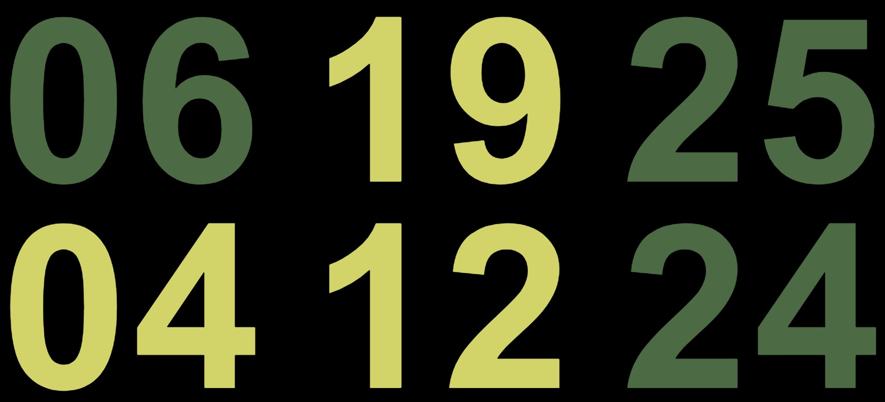

# dartDown

> Note: this project is a modification of the [`bartDown`](https://github.com/powerlanguage/bartDown) project created by James Wardle ([@powerlanguage](https://github.com/powerlanguage)).

 

 

_dartDown_ displays the estimated departure times for a [DART station](https://www.irishrail.ie/).  It aims to make functional information aesthetically pleasing so it can be displayed in the home. North and South-bound departures are on the top and bottom row respectively.  Colors denote the relative distance of the final destination from the city center (Malahide/Greystones = dark green, Howth/Bray = light green).

See it in action: https://mcguinlu.github.io/dartDown/

## Configuration:

_dartDown_ can be customized using the following url parameters:

* `?station=gcdk` - [station of origin abbreviation](https://api.irishrail.ie/realtime/realtime.asmx/getAllStationsXML), default Grand Canal Dock.
* `?limit=5` - number of trains to display in either direction, default 3
* `?minute_cutoff=2` - departure times below the cutoff will not be displayed, default 3
* You can chain multiple parameters together using & E.g. https://mcguinlu.github.io/dartDown/?station=mhide&limit=5&minute_cutoff=5

## Misc:

* Because the [Irish Rail API](https://api.irishrail.ie/realtime/) does not require a key, I can host the app via GitHub pages. Otherwise, I'd need a hosting solution that allows for secrets.
* This project makes use of the [`xml2json` API](https://github.com/factmaven/xml-to-json) maintained by [@factmaven](https://github.com/factmaven): 
* This project uses: [offline by Stéphanie Rusch from the Noun Project](https://thenounproject.com/term/offline/90580)
